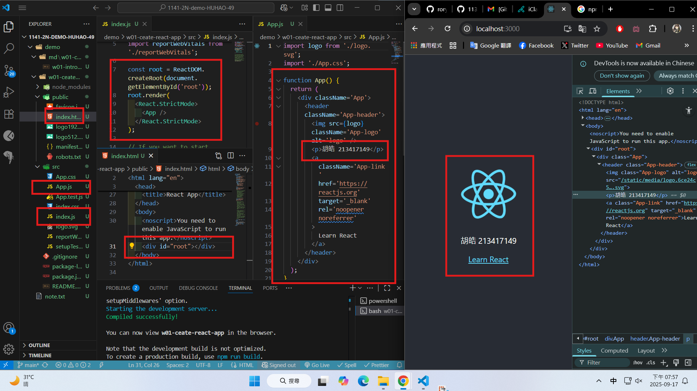
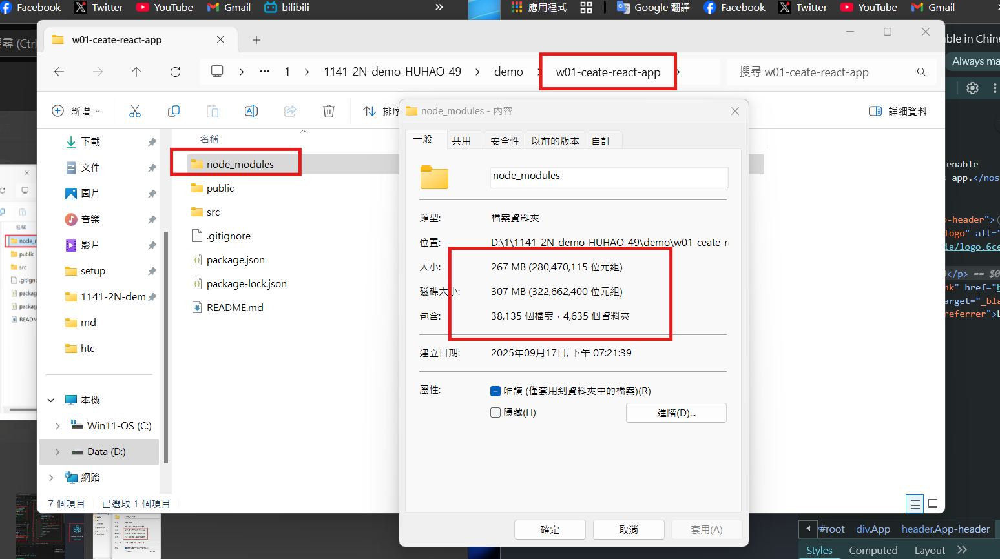
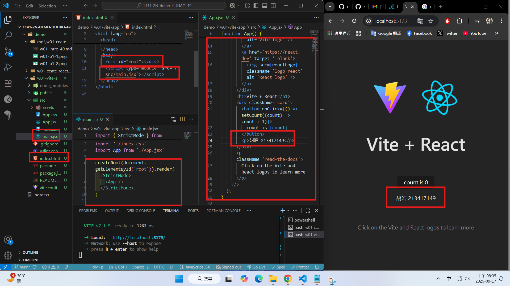
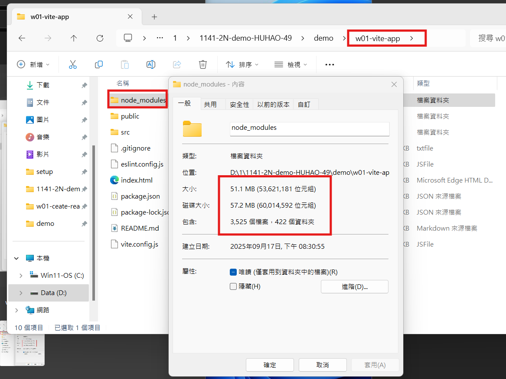
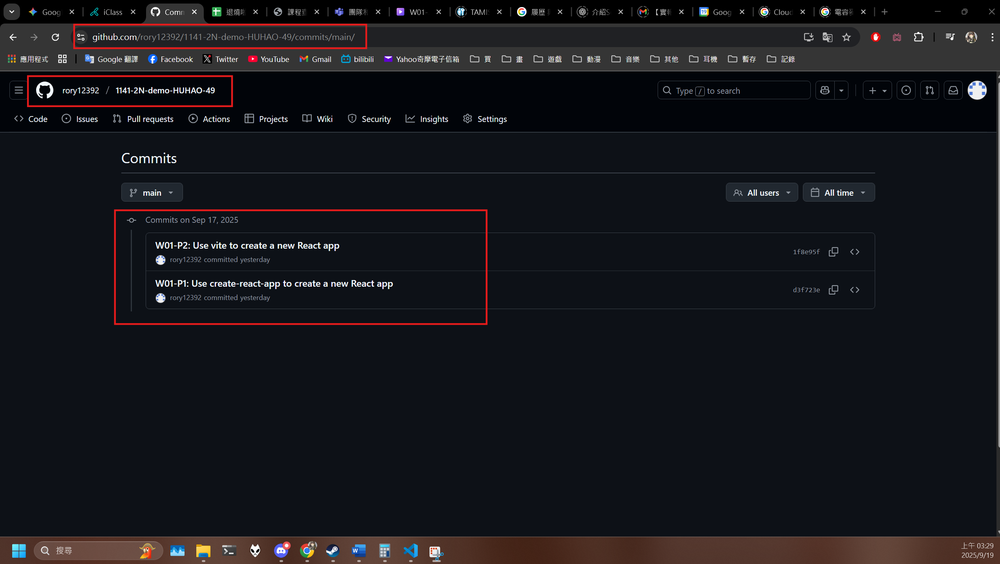
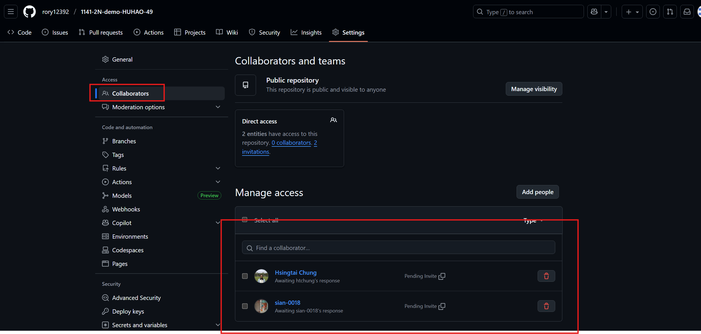

[Github URL](https://github.com/rory12392/1141-2N-demo-HUHAO-49)

### W01-P1: Use create-react-app to create a new React app

#### => show how the index.html page being rendered



#### => share the size of node module



```
1f8e95f rory12392 Wed Sep 17 20:39:21 2025 +0800  W01-P2: Use vite to create a new React app
```

### W01-P2: Use vite to create a new React app

#### => show how the index.html page being rendered



#### => share the size of node module



```
d3f723e rory12392 Wed Sep 17 20:07:14 2025 +0800  W01-P1: Use create-react-app to create a new React app
```

### W01-logs: git logs of W01



