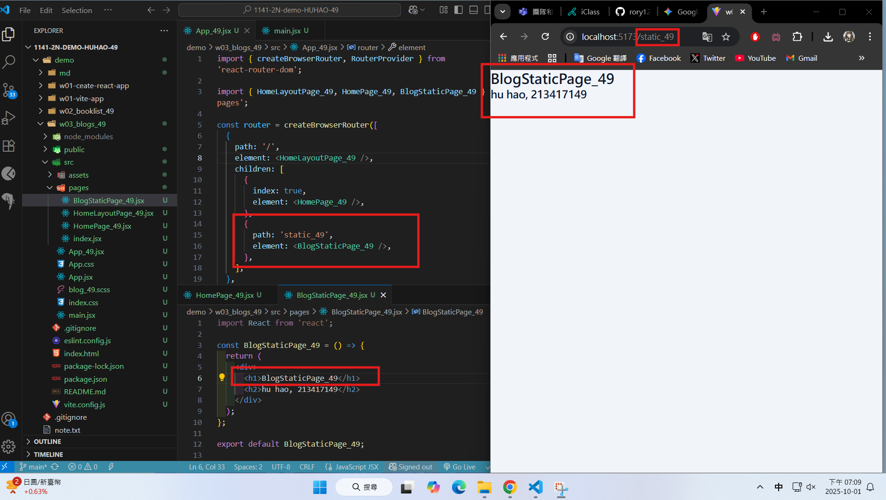
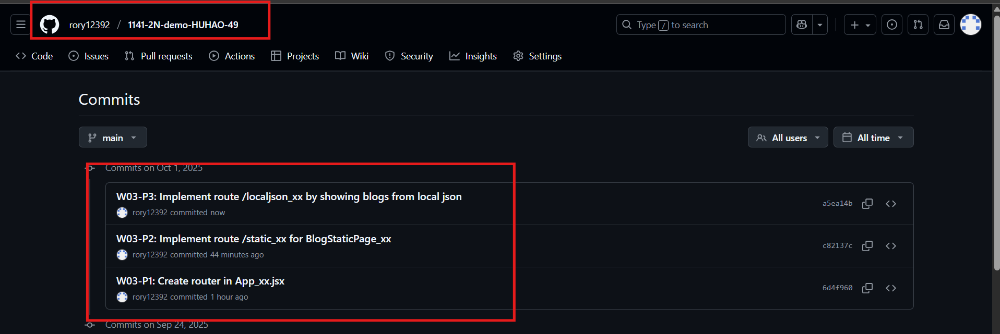

[Github URL](https://github.com/rory12392/1141-2N-demo-HUHAO-49)

### W03-P1: Create router in App_xx.jsx

#### => route / for HomePage_xx


#### => route /static_xx for BlogStaticPage_xx



```

```

### W03-logs: git logs of W02


