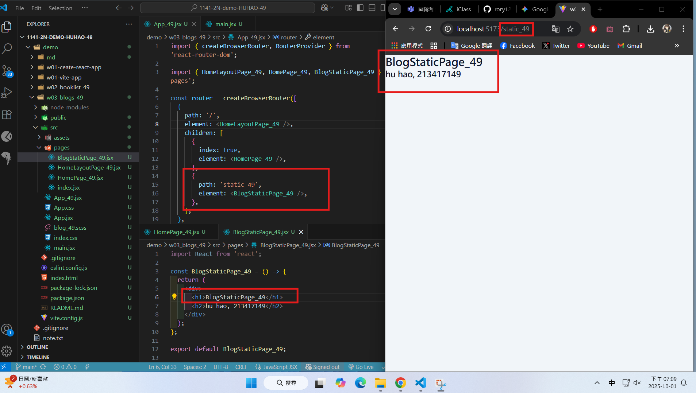
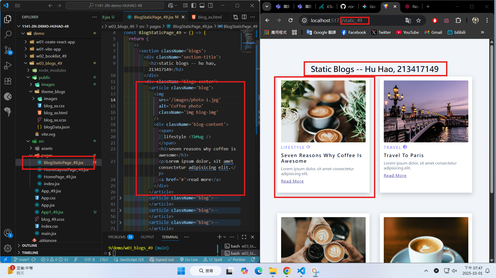
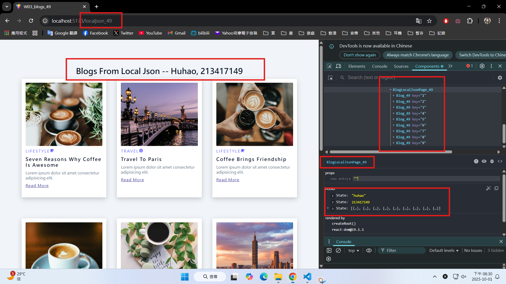
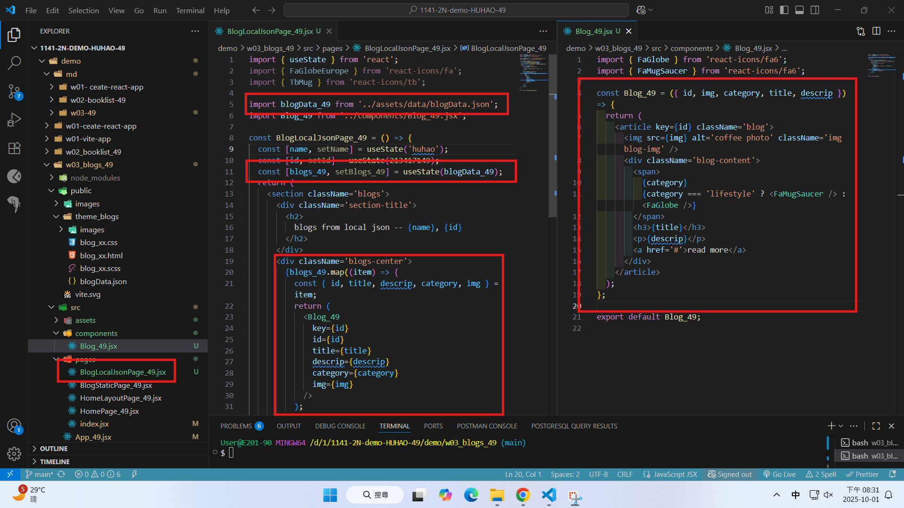

[Github URL](https://github.com/rory12392/1141-2N-demo-HUHAO-49)

### W03-P1: Create router in App_xx.jsx

#### => route / for HomePage_xx


#### => route /static_xx for BlogStaticPage_xx



```
6d4f960 rory12392 Wed Oct 1 19:19:58 2025 +0800  W03-P1: Create router in App_xx.jsx
```

### W03-P2: Implement route /static_xx for BlogStaticPage_xx



```
c82137c rory12392 Wed Oct 1 19:48:49 2025 +0800  W03-P2: Implement route /static_xx for BlogStaticPage_xx
```

### W03-P3: Implement route /localjson_xx by showing blogs from local json

#### => Chrome demo using React DevTools



#### => code for BlogLocalJson_xx



```
a5ea14b rory12392 Wed Oct 1 20:33:00 2025 +0800  W03-P3: Implement route /localjson_xx by showing blogs from local json
```

### W03-logs: git logs of W03


