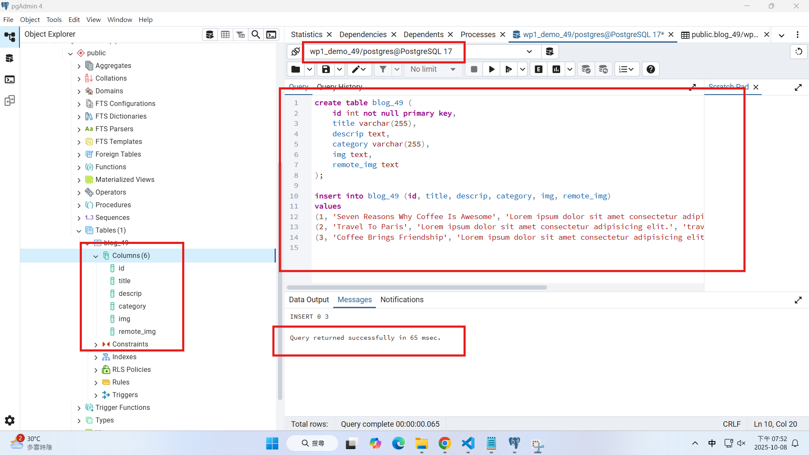
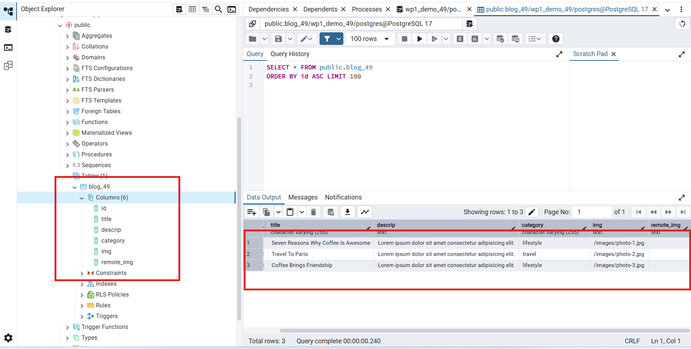
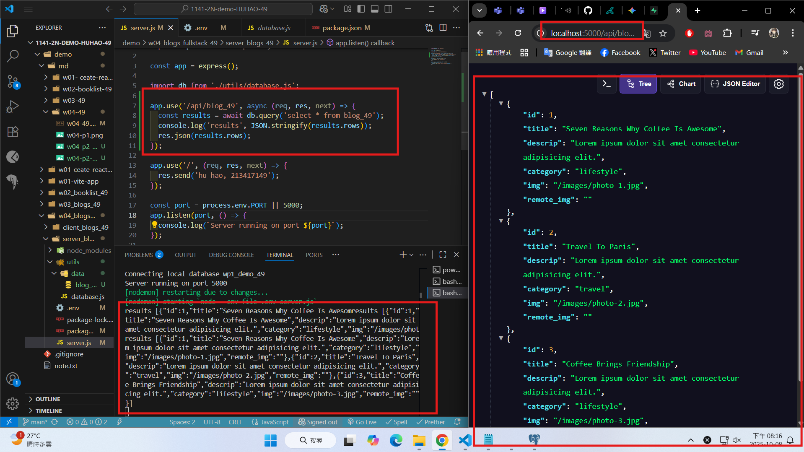
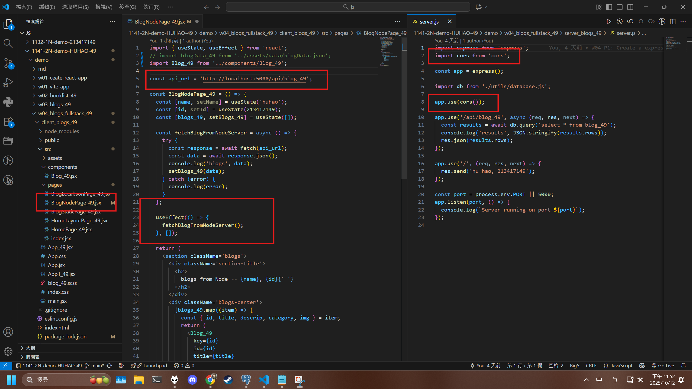
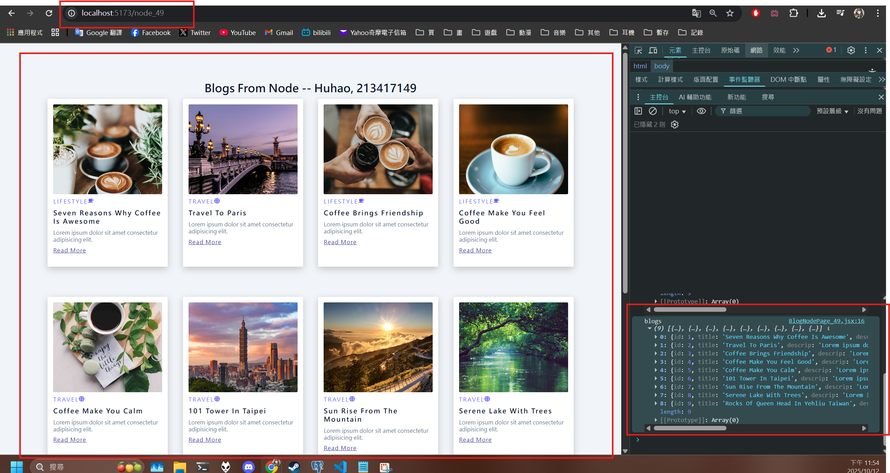
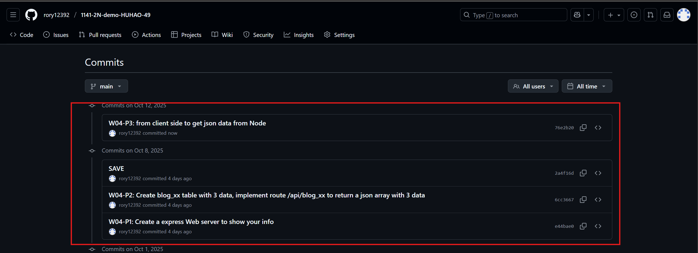

[Github URL](https://github.com/rory12392/1141-2N-demo-HUHAO-49)

### W04-P1: Create a express Web server to show your info


```
e44bae0 rory12392 Wed Oct 8 19:38:36 2025 +0800 W04-P1: Create a express Web server to show your info
```

### W04-P2: Create blog_xx table with 3 data, implement route /api/blog_xx to return a json array with 3 data

#### => SQL to create blog_xx table and 3 data



#### => show 3 data



#### => implement route /api/blog_xx



```
6cc3667 rory12392 Wed Oct 8 20:17:47 2025 +0800 W04-P2: Create blog_xx table with 3 data, implement route /api/blog_xx to return a json array with 3 data
```

### W04-P3: from client side to get json data from Node

#### => modified client and server code



#### => Chrome, show 3 blogs



```

```

### W04-logs: git logs of W04


