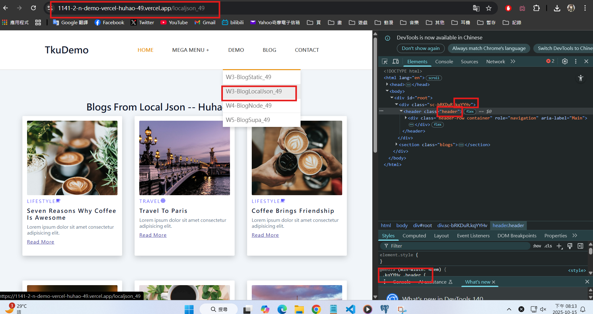
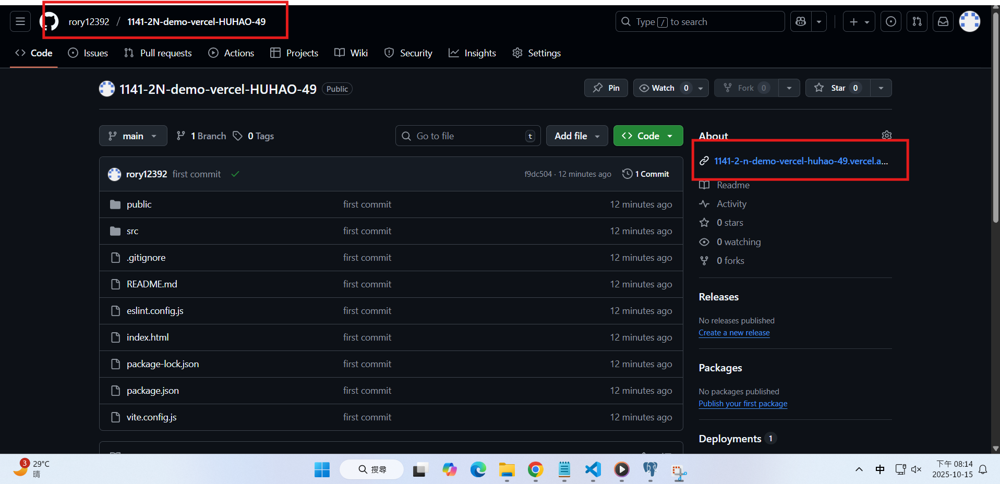

[Github URL](https://github.com/rory12392/1141-2N-demo-HUHAO-49)

### W05-P1: Create Navbar_xx using styled components, and show BlogNodePage_xx

##### => Chrome


##### => relevant code


```
82849d1 rory12392 Wed Oct 15 19:55:39 2025 +0800  W05-P1: Create Navbar_xx using styled components, and show BlogNodePage_xx
```

### W05-P2: Deploy the code to Vercel

#### => Show BlogLocalJson in Vercel



#### => Github repo with Vercel link



#### => Github demo_vecel repo and Vercel URL

[Github URL for Vercel](https://github.com/rory12392/1141-2N-demo-vercel-HUHAO-49)
[Vercel URL](https://1141-2-n-demo-vercel-huhao-49.vercel.app/)

```

```

### W04-logs: git logs of W04


