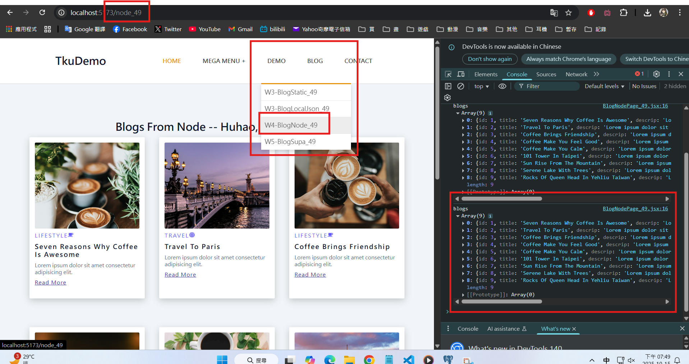
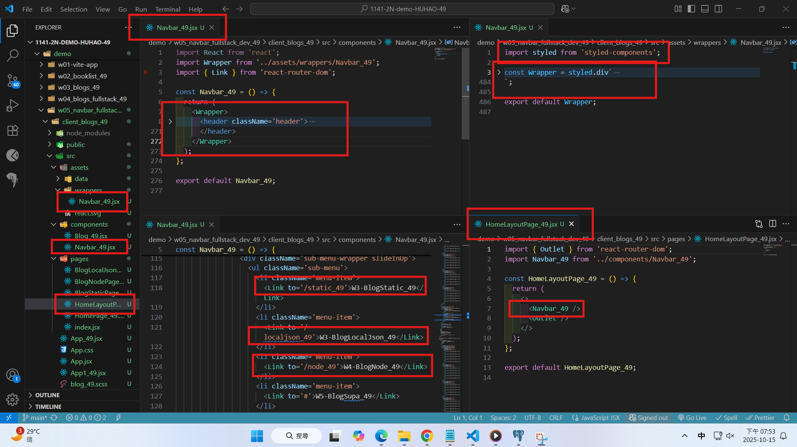

[Github URL](https://github.com/rory12392/1141-2N-demo-HUHAO-49)

### W05-P1: Create Navbar_xx using styled components, and show BlogNodePage_xx

##### => Chrome



##### => relevant code



```

```

### W04-logs: git logs of W04


