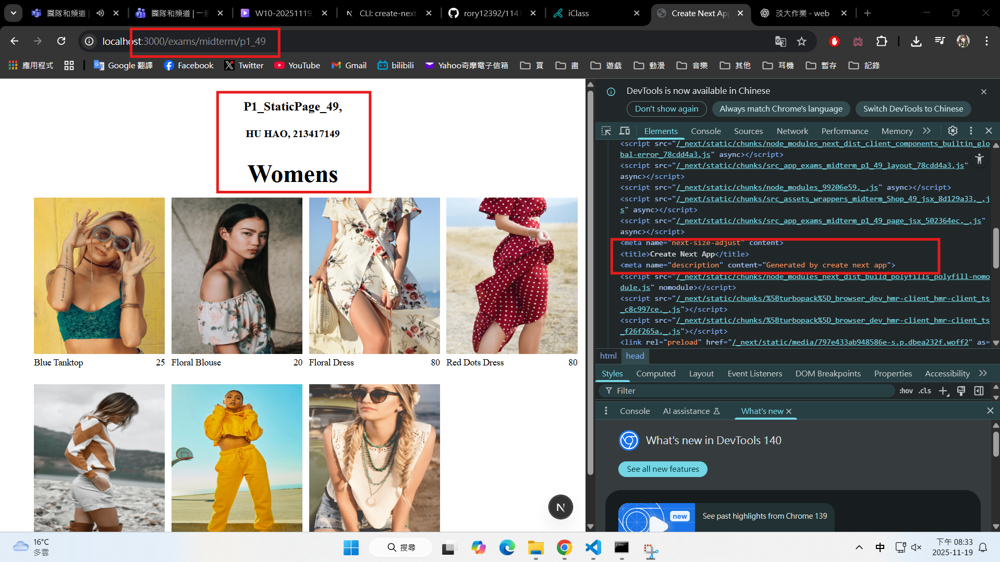
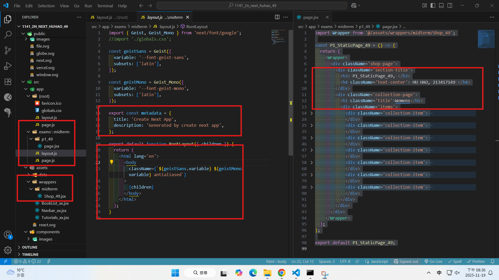
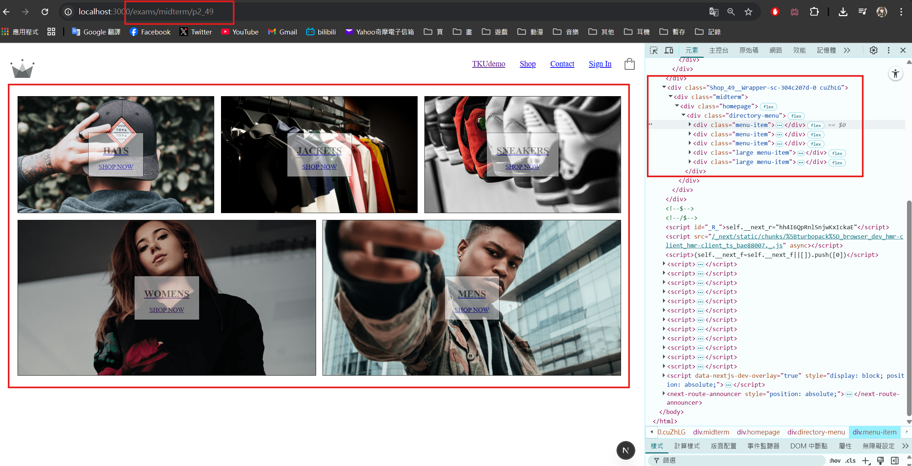
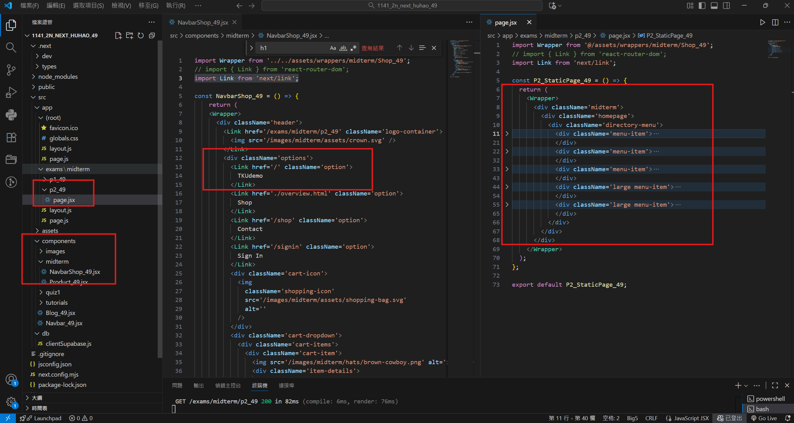
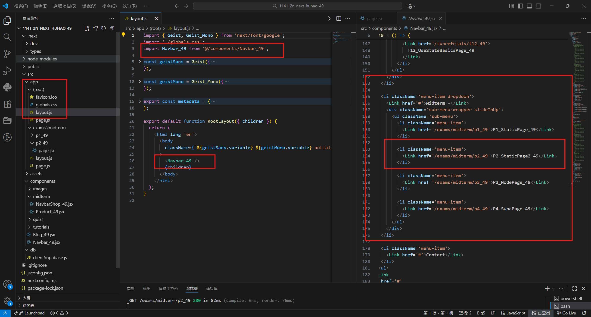
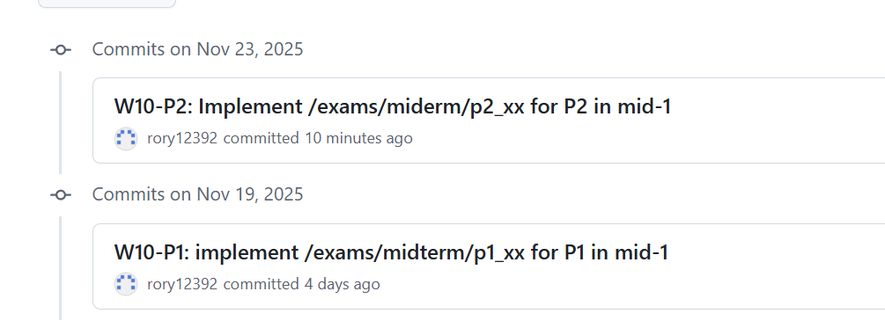

[Github URL](https://github.com/rory12392/1141-2N-demo-HUHAO-49)
[Github URL for Vercel](https://github.com/rory12392/1141-2N-demo-vercel-HUHAO-49)
[Vercel URL](https://1141-2-n-demo-vercel-huhao-49.vercel.app/)

### W10-P1: implement /exams/midterm/p1_xx for P1 in mid-1

##### => Chrome, show P1 page with meta data



##### => show the relevant code



```
3640df1 rory12392 Wed Nov 19 20:38:09 2025 +0800 W10-P1: implement /exams/midterm/p1_xx for P1 in mid-1
```

### W10-P2: Implement /exams/miderm/p2_xx for P2 in mid-1
 
#### => shown in Chrome
 

 
#### => the relevant code for P2
 

 
#### => Navbar_xx for root layout
 

 
```
0756d80 rory12392Sun Nov 23 18:48:29 2025 +0800 W10-P2: Implement /exams/miderm/p2_xx for P2 in mid-1
```

### W10-logs: git logs of W10


