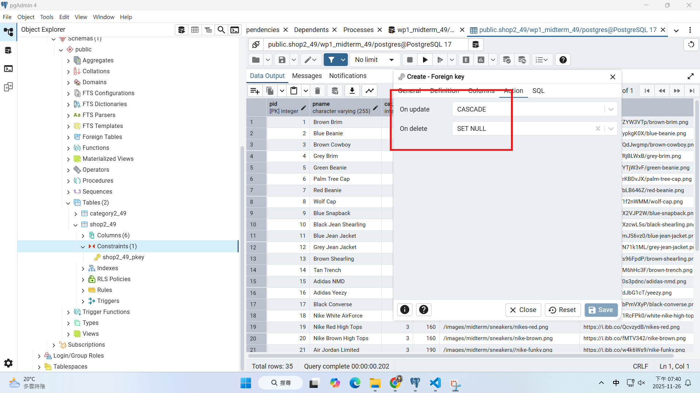
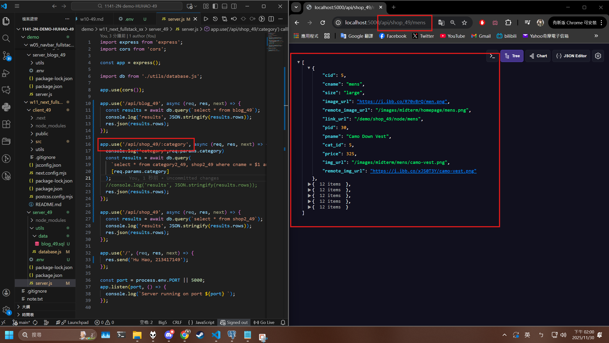

[Github URL](https://github.com/rory12392/1141-2N-demo-HUHAO-49)

[Github URL for Vercel](https://github.com/rory12392/1141-2N-demo-vercel-HUHAO-49)
[Vercel URL](https://1141-2-n-demo-vercel-huhao-49.vercel.app/)

[Github Next URL](https://github.com/rory12392/1141_2n_next_huhao_49)
[Vercel Next URL](https://1141-2n-next-huhao-49.vercel.app/)

### W11-P1: Implement route /api/shop_xx/:category in server
 
##### => create tables category2_xx and shop2_xx using SQL and set foreign key of cat_id referencing to cid in category2_xx
 

 
##### => update and delete constraints of the foreign key
 

 
##### => Chrome, show /api/shop_xx/womens with code (you need to use last two digits of your id)
 

 
##### => Chrome, show /api/shop_xx/mens with code (you need to use last two digits of your id)
 

 
```

```


### W11-logs: git logs of W11


