[Github URL](https://github.com/rory12392/1141-2N-demo-HUHAO-49)

[Github URL for Vercel](https://github.com/rory12392/1141-2N-demo-vercel-HUHAO-49)
[Vercel URL](https://1141-2-n-demo-vercel-huhao-49.vercel.app/)

[Github Next URL](https://github.com/rory12392/1141_2n_next_huhao_49)
[Vercel Next URL](https://1141-2n-next-huhao-49.vercel.app/)

### W12-P1: Refine code of /demo/shop_xx/node

##### =>

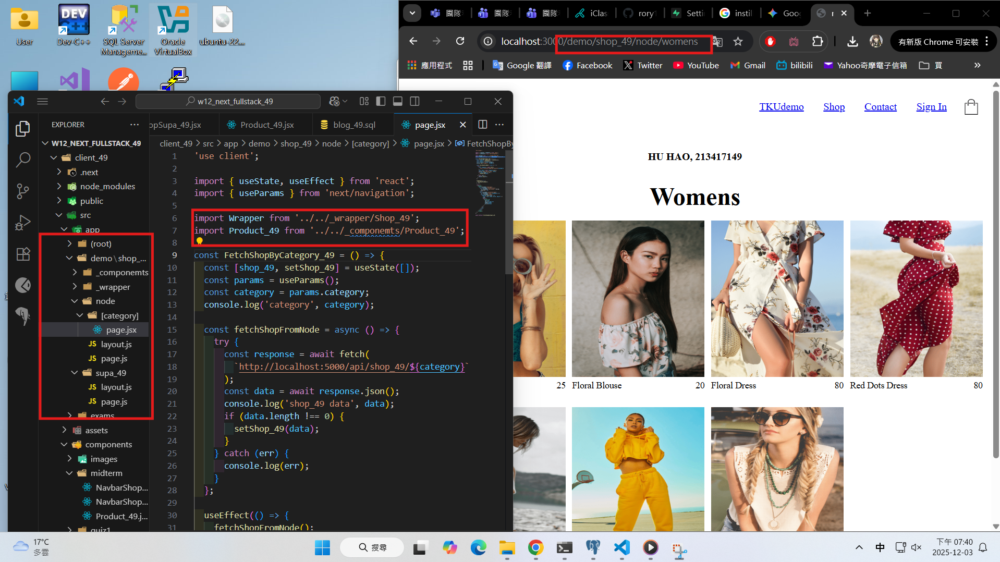

```
610b2a8 rory12392 Wed Dec 3 19:45:57 2025 +0800   W12-P1: Refine code of /demo/shop_xx/node
```

### W12-P2: Deploy code to Vercel

#### => npm run build

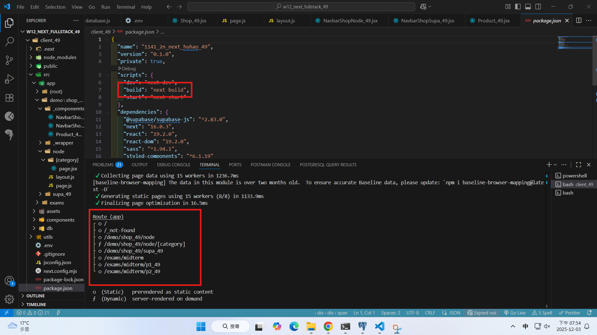

#### => npm start

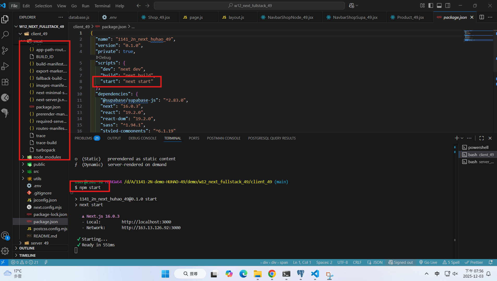

#### => Vercel, add environment variables

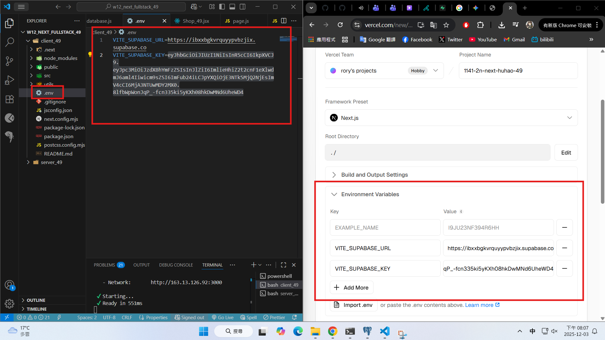

#### => Vercel homepage success

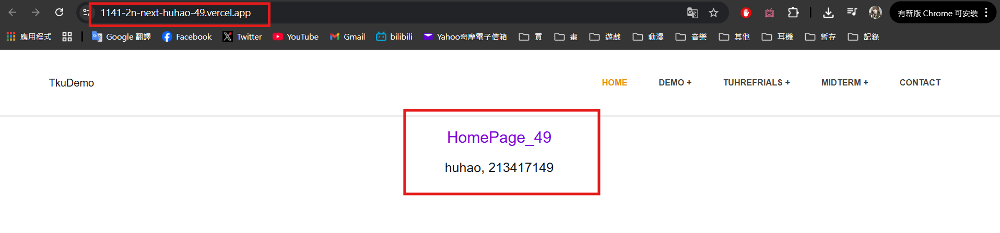

#### => Github repo and Vercel URL

[Gitbub Next URL](https://github.com/rory12392/1141_2n_next_huhao_49)
[Vercel Next URL](https://1141-2n-next-huhao-49.vercel.app/)

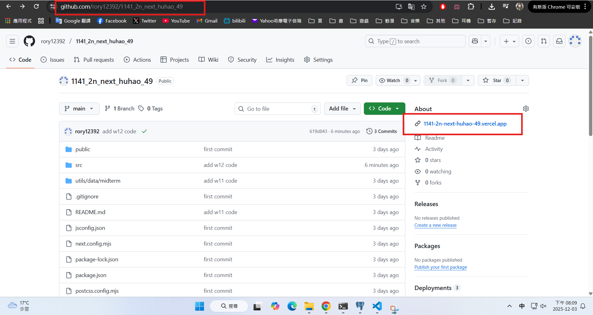

#### => Share to teacher and TA

htchung@gms.tku.edu.tw
sian-0018

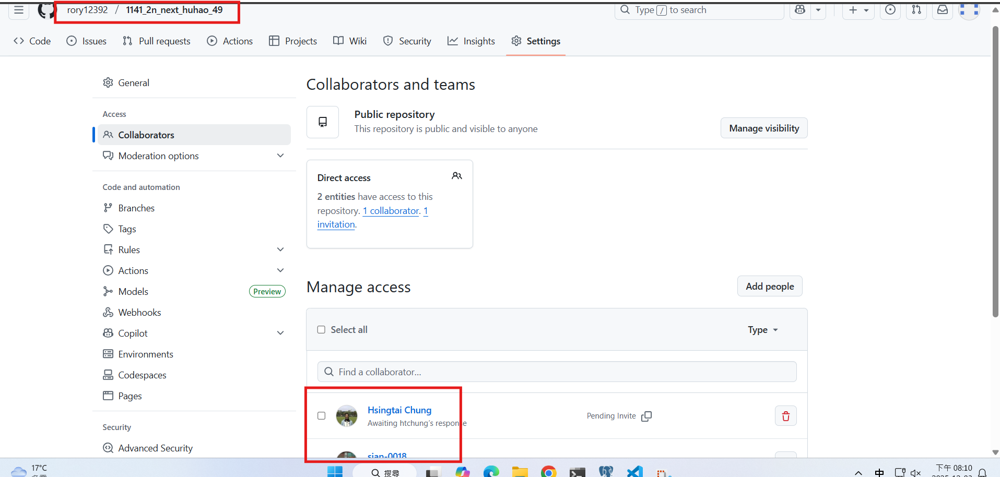

```
0eda3a0 rory12392 Wed Dec 3 20:14:00 2025 +0800   W12-P2: Deploy code to Vercel
```

### W12-P3: Implenment /demo/shop2_xx/supabase to fetch products from Supabase

#### => use SQL to get category2_xx data

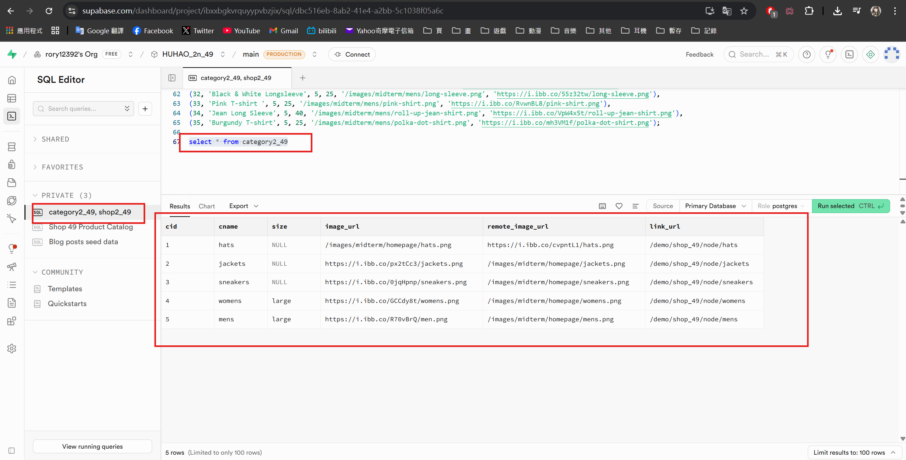

#### => use SQL to get shop2_xx data

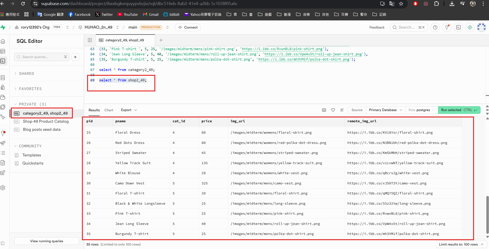

#### => set foreign key

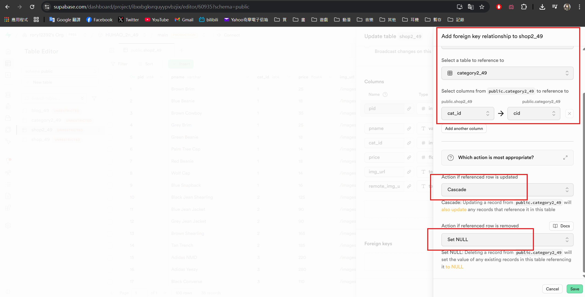

#### => set RLS policies for public access for all CRUD

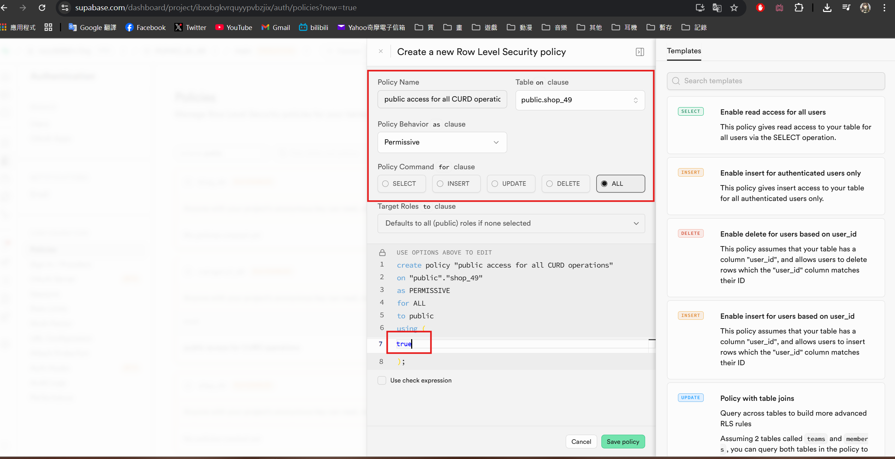

#### => Chrome -- local

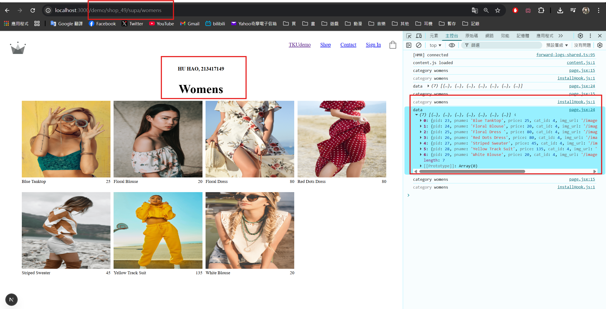

#### => Chrome -- Vercel

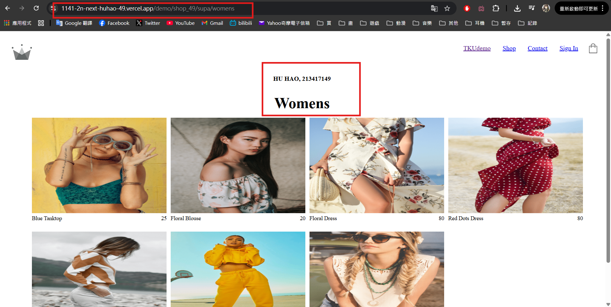

```
c044d63 rory12392 Wed Dec 10 19:08:50 2025 +0800  W12-P3: Implenment /demo/shop2_xx/supabase to fetch products from Supabase
```

### W12-logs: git logs of W12

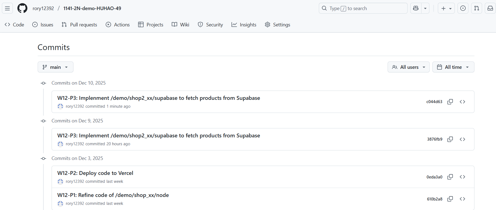
