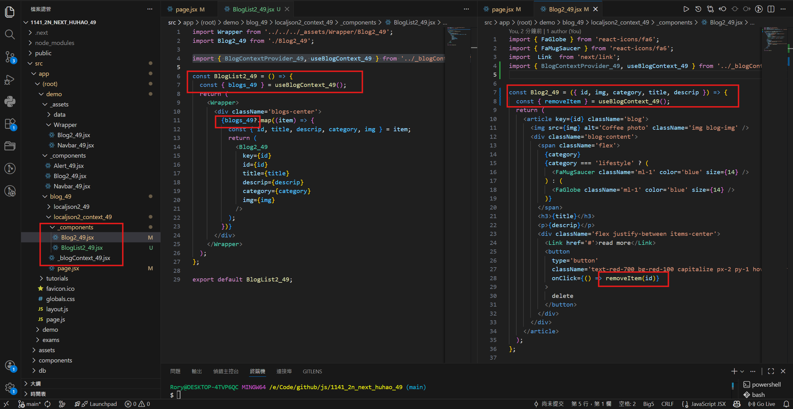
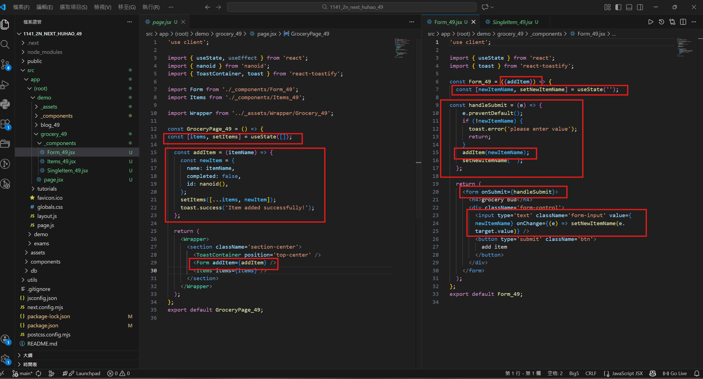

[Github URL](https://github.com/rory12392/1141-2N-demo-HUHAO-49)

[Github URL for Vercel](https://github.com/rory12392/1141-2N-demo-vercel-HUHAO-49)
[Vercel URL](https://1141-2-n-demo-vercel-huhao-49.vercel.app/)

[Github Next URL](https://github.com/rory12392/1141_2n_next_huhao_49)
[Vercel Next URL](https://1141-2n-next-huhao-49.vercel.app/)

### W14-P1: Use Context for Blogs_xx
 
#### => Chrome, show blogs_xx in Content component
 

 
#### => relevant code
 

 
```

```

### W14-P2: Refine W14-P1 by using BlogList2_xx
 
#### => Chrome, show BlogList2_xx, Blog2_xx component
 

 
#### => relevant code
 

 
```

```

###¡@W14-P3: Implement /demo/grocery_xx for Grocery_xx
 
#### => Chrome, add two data, and shown in components
 

 
#### => relevant code
 

 
```

```

### W14-logs: git logs of W14


